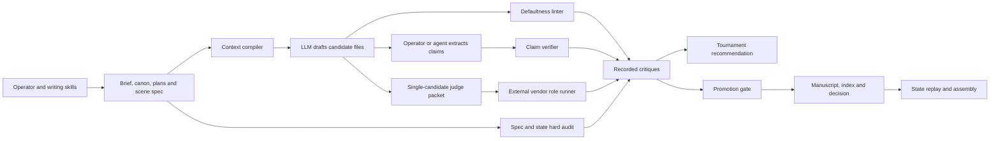

# Fiction Compiler: independently rechecked audit and improvement proposal

> **Rechecked update, 28 September 2026.** The [follow-up review](/Users/kstroevsky/Desktop/dev/fiction-compiler-starter/docs/audits/2026-09-28/review.md) adds stored-record analysis and core-design proposals. Its latest corrections are explained in [recheck notes](/Users/kstroevsky/Desktop/dev/fiction-compiler-starter/docs/audits/2026-09-28/recheck.md):
> - Two briefs explicitly reference the premise probes, establishing framework influence but not its full causal effect or clause authorship.
> - Seven of twelve manifest-bearing promotions lack a same-role, hash-bound re-review of a filename-inferred predecessor’s non-pass criticism; persistence of those defects is not established.
> - The loaf inconsistency appears in the scene plan as well as the prose.
> - **The original Tian table labels below are correct:** Overall is 23% versus 68%; Character is 23% versus 50%. The proposed follow-up correction misread the columns. The abstract’s “over 40%” wording belongs to the paper’s authors.
> - Additional probes include implementation defects, overlaps and policy gaps; they are not eight independent new bugs.
> - Trust fixes and isolated literary measurement proceed in parallel. Extraction, reader-state predictions and benchmark results must retain explicit uncertainty.

Assessment date: 27 September 2026. Repository: `310e50cfe9b8087c8a2af64e6e74f098548e6824`. This is an audit and a proposal, not an implemented redesign or a certification of literary quality.

**The repository has a useful foundation, but neither its acceptance guarantees nor its contribution to prose quality have been demonstrated. Fix the trust failures and establish a literary experiment at the same time. Do not make a comprehensive narrative simulator the prerequisite for discovering whether the approach works.**

Your original audit is substantially right about the implementation defects. Its weakest parts are causal attribution of the house style, selective treatment of research, and the scale and order of the proposed replacement architecture. This report corrects those points, reproduces the central engineering failures, and adds defects and experiments that the original audit missed.

The strongest architectural choices should survive: separate fabula, discourse and realization; preserve alternatives; reconstruct state; attach evidence to criticism; distinguish story revision from framework revision; preserve disagreement. A deterministic boundary can establish artifact identity and enforce explicitly modeled constraints. It cannot turn incomplete extraction or a subjective critic into an objective authority.

## Evidence and scope

I read all 23 Python package modules and all 13 scripts, inspected all 11 schemas, the agent and skill configurations, test suites, craft cards, design and decision documents, project briefs and style/discourse plans. I read all five assembled manuscripts and the two promoted scenes of the unfinished sixth project. I inspected the candidate/critique inventory across all six projects and selected creative decision records; I did **not** perform a separate close reading of every rejected candidate or manually authenticate every historical critique.

The checkout was the same commit as your supplied audit. Pre-existing untracked `.agents/` and `.codegraph/` directories were preserved. The eight `.agents/skills/` copies match their `.claude/skills/` counterparts byte-for-byte. The agents-best-practices upstream was checked and pinned to `f876db4dfd9617feab7df78653c591fb1a65fd79`; its guidance is an engineering reference, not literary evidence.

Fresh baseline results, Python 3.14.7:

| Check | Result | What this establishes |
|---|---|---|
| `python3 scripts/validate_workspace.py` | Pass | The validator accepts this checkout; not complete semantic or provenance validity |
| `python3 -m unittest discover -s tests -v` | 193 tests pass | Existing tested behaviors are stable |
| `python3 scripts/run_regression.py` | 28/28 pass | Pinned deterministic fixtures still pass |
| `python3 scripts/run_critic_eval.py` | 7/9 scored, 2 need live output | The small deterministic examples pass; actual LLM critics remain uncalibrated |
| Additional isolated probes | 24 recorded observations | Direct reproductions of failures and boundary behavior, detailed below |

The probes create disposable projects under a temporary directory. Vendor calls use an offline transport. The promotion race is reproduced through a deterministic interleaving at the actual lock boundary, rather than relying on a probabilistic stress test. No live vendor integration, live critic benchmark, professional-reader study, hard-kill recovery experiment or comprehensive penetration test was run. Independent here means rechecking your audit against source and executable behavior; it does not mean several independent human reviewers participated.

Evidence: [baseline logs and reproducible probes](/Users/kstroevsky/Desktop/dev/fiction-compiler-starter/docs/audits/2026-09-27/evidence/README.md), [repository snapshot](/Users/kstroevsky/Desktop/dev/fiction-compiler-starter/docs/audits/2026-09-27/evidence/repository-manifest.json), [candidate status inventory](/Users/kstroevsky/Desktop/dev/fiction-compiler-starter/docs/audits/2026-09-27/evidence/candidate-status.json), [research synthesis](/Users/kstroevsky/Desktop/dev/fiction-compiler-starter/docs/audits/2026-09-27/research.md), [proposed experiments](/Users/kstroevsky/Desktop/dev/fiction-compiler-starter/docs/audits/2026-09-27/experiments.md).

## Corrections to the supplied audit

| Original claim or recommendation | Revised judgment |
|---|---|
| The trust gates are bypassable | Confirmed, with fresh isolated reproductions |
| Five completed manuscripts, 1,301–1,758 words | Correct for assembled files, including headings; there are six non-template projects, 18 scene specs, 17 accepted scenes and 46 candidate files. Salt in the Wire has only two promoted scenes and no assembled manuscript |
| The pipeline caused a new house style | Plausible but not established by those outputs: the briefs and style profiles explicitly demand much of the similarity. The global premise rubric and blocking regex rules provide stronger evidence of architectural bias |
| Knowledge-base counterexamples and competing theories must be added | They already exist in the index and static-scene card. The problem is inconsistent application, weak provenance granularity, missing breadth and no demonstrated benefit from retrieval |
| Drafting models must never see facts the focalizer does not know | Too strong. A writer may need hidden truth to stage irony and clues. Actor simulation and reader evaluation require restricted views; a writer can receive labeled truth with explicit reveal restrictions |
| Every judge should receive only text already read | Correct for an experiential reader; wrong for a continuity auditor. Different evaluation questions require different packets |
| LLM assessors do not correlate with experts | A result from a particular historical study, not a general conclusion. Other studies report useful agreement under specific protocols; local calibration remains necessary |
| Discourse planning improves writing by more than 40% | Overgeneralized. Tian et al. report particular ranking/preference outcomes, not a universal percentage improvement in prose quality |
| Replace the ledger with a full situation model | Keep event sourcing. Add only the semantic distinctions needed by chosen stories and observed failures; distinguish world time, exposure order and recorded belief |
| Reproduce every artifact from its manifest | Replay stored responses and deterministic checks exactly; fresh provider generations may not reproduce byte-for-byte, even with a recorded seed |
| Keep the human as author | A defensible co-writing product choice, but it changes your stated autonomous-generation objective. Offer assisted and autonomous experimental modes and evaluate them separately |
| Human evaluation comes at P4, after infrastructure and cognition | Reverse this dependency. A small independent evaluation begins immediately and determines which further infrastructure is justified |

For the disputed research claims, see [the primary-source matrix and limitations](/Users/kstroevsky/Desktop/dev/fiction-compiler-starter/docs/audits/2026-09-27/research.md). For example, [Tian et al., Tables 4–6](https://arxiv.org/html/2407.13248v2) show suspense “best” rankings of 7.9% versus 48.3% and overall diversity preference of 23% versus 68% in their respective comparisons. Those are different endpoints; describing them as “40% better literature” would be misleading.

## How the implemented system actually works

There are two execution paths: a human/Codex/Claude operator follows the skills and calls the deterministic tools; an external role runner submits a single candidate to provider APIs and optionally records criticism. Neither is a durable end-to-end generation state machine.

The tournament does not bind or authorize promotion. Promotion does not rerun the audits. The common judge packet does not provide the evidence needed for all specialist roles. The prose checker receives claims rather than raw prose. These are important missing connections, not just missing documentation.

| Component | Implemented responsibility and practical limit |
|---|---|
| `workspace.py`, `schema.py` | Resolve roots; validate a documented JSON-Schema subset. Boundary callers do not consistently invoke validation or use confined resolved paths |
| `state.py`, `ontology.py` | Replay seed ledgers and accepted scene deltas; check predicate names, arity and ID-prefix types. No event-time execution, stable proposition versions or real entity registry |
| `hard_audit.py` | Check declared requirements, typed atoms and accepted-history references. Does not inspect prose or execute a causal graph |
| `context.py` | Select participants, include reconstructed facts and plans, record inclusion reasons. No token budget, actual relevance pruning or prior-prose window |
| `defaultness.py` | Regex detections and rhythm heuristics. Several stylistic suspicions become hard selection/promotion exclusions |
| `prose_audit.py` | Compare submitted claims to state/spec. Neither extraction completeness nor evidence/identity is established |
| `critique.py`, `promote.py`, `integrity.py` | Record critiques, inspect readiness, gate and write promotion, check a partial hash chain. Significant freshness, identity and transaction gaps |
| `tournament.py` | Anonymization maps, presentation-order metadata, penalties, mean score vectors and Pareto selection. Does not execute a verified balanced comparison |
| `revision.py` | Compare finding fingerprints, apply stop rules and waivers. No stable semantic issue identity or exact target requirement |
| `role_runner.py` | Roster, personas, offline and three HTTP transports, parsing and recording. A critic client, not a generator/orchestrator or authenticated review service |
| `premise.py` | Minimum batch size and self-reported architecture signatures; diagnostic questions. Not semantic diversity measurement or a mandatory runtime stage |
| `kb.py` | Small keyword-based craft retrieval. Adequate as a starter; retrieval usefulness is unmeasured |
| `critic_eval.py`, `regression.py` | Tiny planted-case scoring and deterministic regression/fingerprinting. Not literary outcome evaluation |
| `safety.py`, `trace.py` | Advisory injection patterns, prompt delimiters, best-effort event logs. No proof of injection resistance or durable complete replay |
| `assemble.py`, `__init__.py` | Concatenate indexed manuscript files; package entry. Assembly checks missing files but not reviewed-byte integrity |
| `tools.py`, CLI scripts, MCP server | Twenty tools and command wrappers. Interfaces differ in validation, supported options, persistence and exit semantics |

## Confirmed engineering findings

Severity here concerns reliable use of the prototype: **P0** can corrupt or falsely authorize canon; **P1** can invalidate evaluation or narrative correctness; **P2** is a narrower operational weakness. It is not an internet-exploit severity rating. All findings below are high-confidence source observations; those marked **R** have a recorded reproduction.

### P0 — Acceptance evidence does not establish authorized, fresh review (R)

[src/fiction_compiler/promote.py:45](/Users/kstroevsky/Desktop/dev/fiction-compiler-starter/src/fiction_compiler/promote.py:45) trusts an explicit `audit_class`; [src/fiction_compiler/critique.py:55](/Users/kstroevsky/Desktop/dev/fiction-compiler-starter/src/fiction_compiler/critique.py:55) accepts it from a caller. Three fabricated passing records from an arbitrary critic, plus a spec containing only its ID, promoted successfully. The spec had eleven missing required fields. The scene-level hard critique is exempt from candidate hashing and has no spec/delta/canon input digest. One literary-class critic is sufficient, even if it is only the continuity persona.

A useful local fix is **runtime-owned audit production and exact input binding**, not immediately a signature infrastructure: validate inputs at promotion; execute cheap deterministic checks there; accept literary results only from recorded jobs tied to frozen candidates and a declared review policy. A free-form critique can remain an advisory import. Separate `spec_hard`, `prose_consistency`, and editorial judgments rather than allowing one label to substitute for all hard evidence.

`approved_by` is an annotation, not authenticated approval. Only the literal `promotion` token is enforced; the examples' `premise`, `voice-profile`, `ending`, and `final` tokens are not implemented as runtime gates. The promotion CLI cannot supply `approved_by` or `rubric_version`, so it cannot serve a promotion-gated project without another entry point. Make readiness report the same structural, audit, provenance and approval conditions as commit; today `scene_status` omits the human gate.

**Threat-model qualification:** an agent with unrestricted write/shell access can edit a local ledger and its hashes. If protection from such an agent is required, put the canonical write service and approval authority outside its permissions. Signing records with a key the same agent can read does not solve that problem. For an operator-owned local prototype, preventing mistakes and providing transparent tamper evidence may be the appropriate scope.

### P0 — The lock protects writes after decisions have gone stale (R)

[src/fiction_compiler/promote.py:144](/Users/kstroevsky/Desktop/dev/fiction-compiler-starter/src/fiction_compiler/promote.py:144) reads/hash-checks candidates, critiques, canon head and index before entering the lock at [src/fiction_compiler/promote.py:239](/Users/kstroevsky/Desktop/dev/fiction-compiler-starter/src/fiction_compiler/promote.py:239). In the controlled interleaving, both promotions returned success, the final index contained only `ch01-sc01`, both manuscript files existed, and `verify_canon()` reported no errors. Candidate bytes are also read again inside the write block, after their earlier digest was accepted.

Begin the transaction before reading mutable state; freeze input bytes; compare the expected parent head at commit; reject duplicate/out-of-order commits or implement an explicit branch/rebase operation. An idempotent retry must return the existing identical result, not rewrite a chain link. Re-promoting a scene currently breaks the chain; that is reproduced too.

For multi-file crash recovery, choose one authoritative transaction: SQLite with properly configured transactions/durability, or immutable content objects followed by a single atomic manifest/head update and explicit recovery. SQLite cannot atomically cover arbitrary external Markdown writes; make manuscript files derived views or include their authoritative content in the committed storage. Moving the existing lock alone does not make `AtomicBatch` kill-safe.

### P0 — The verifier certifies less than the documentation says (R)

[src/fiction_compiler/integrity.py:67](/Users/kstroevsky/Desktop/dev/fiction-compiler-starter/src/fiction_compiler/integrity.py:67) traverses only indexed scenes. It does not check manuscript bytes, critique digests or decision/artifact reachability. Editing a promoted manuscript produced a clean verification result. Missing/legacy manifests lose the chain anchor rather than produce an “unverified” result. The interleaved promotion leaves an orphan it cannot discover.

Check index → decision → every referenced artifact **and** reverse reachability. Report `verified`, `legacy_unverified`, `invalid`, and `orphaned` explicitly. A content hash is useful corruption evidence, but an unanchored hash chain is not independent authentication. Verify candidate, manuscript, input snapshot, policy and audits; reconstruction and assembly should refuse invalid authoritative snapshots.

### P0/P1 — The tool boundary has validation and confinement gaps (R)

[src/fiction_compiler/tools.py:525](/Users/kstroevsky/Desktop/dev/fiction-compiler-starter/src/fiction_compiler/tools.py:525) checks only literal argument names `project` and `path`, then dispatches without applying the advertised schema. `scene_id`, `filename`, candidate aliases, revision paths and roster/persona paths need their own policy. The filename probe wrote `critiques/../escaped.json`, outside the intended directory. Absolute revision candidates can be read outside the project by the handler. Scope and impact depend on host permissions.

Use one validated request model per operation, anchored scene IDs, generated evidence filenames and returned confined paths. Resolve symlinks and enforce the intended **scene** directory where appropriate. Reject unknown arguments and distinguish malformed input from execution failure. Do not count a descriptive tool schema as enforcement.

### P1 — Vendor judgments can bind to bytes the vendor never saw (R)

[src/fiction_compiler/role_runner.py:327](/Users/kstroevsky/Desktop/dev/fiction-compiler-starter/src/fiction_compiler/role_runner.py:327) builds the packet, waits, then re-records against the current file. In the probe, the sent/reported input hash remained the old hash while the recorded critique hash matched a replacement written during the call. `judge_bundle` also reads prose and hashes the path separately.

Read once, derive text and digest from the same bytes, store the immutable packet, and record against its artifact ID. Refuse stale input or retain the result only against the old artifact. Persist request parameters, prompt/persona digest, response, provider metadata and validation result. Same-role retries currently overwrite the same critique file; immutable attempt IDs are needed to preserve the evidence.

### P1 — Selection can contradict eligibility, coverage and dissent (R)

At [src/fiction_compiler/tournament.py:135](/Users/kstroevsky/Desktop/dev/fiction-compiler-starter/src/fiction_compiler/tournament.py:135), scene-level fatal audits are skipped because only `.md` candidates enter the floor. Missing checks are not treated as missing evidence. Partial judgment matrices quietly omit candidates. An asymmetric judge split still produces `select` with `disagreement: true`; the recommendation is computed before dissent is incorporated. No judgment schema, snapshot, rubric range, complete candidate set or actual presentation order is enforced.

The penalty path also makes the number of critics/findings an implicit quality score: more scrutinized or longer candidates can accumulate more penalties. The positive-score path averages potentially incomparable scales; ranking sums dimensions without user weights. Pareto mathematics does not repair biased or missing observations.

Freeze candidates independently of their critiques; calculate eligibility using the same verified predicate as promotion; require complete declared dimensions and judge coverage; attach order receipts; preserve pairwise preferences and abstentions. Make material dissent and missing evidence influence the result. Retain positive literary qualities separately from error counts. A tie must remain a tie rather than inherit dictionary order.

### P1 — “Claim verification” is incomplete and has unsound rules (R)

[src/fiction_compiler/prose_audit.py:49](/Users/kstroevsky/Desktop/dev/fiction-compiler-starter/src/fiction_compiler/prose_audit.py:49) accepts `{}` and returns `pass` with confidence 1.0. A schema-valid artifact with the wrong scene ID, mixed tense, an invented quotation and an unobserved newly added fact also passed. The CLI validates the claims schema, unlike the library/MCP route, but schema validity alone does not establish completeness or meaning.

Every `facts_added` ID is granted to the focalizer at [src/fiction_compiler/prose_audit.py:61](/Users/kstroevsky/Desktop/dev/fiction-compiler-starter/src/fiction_compiler/prose_audit.py:61); a fact becoming true is not a perception event. A claim occurring early can use knowledge acquired later in the same scene. Location checks compare only with pre-scene state and inspect stored predicates even when their value is false. Omniscient/variable narration is treated as head-hopping because the checker assumes one focalizer without consulting the full narration policy. Word count is trusted from extraction; actual bytes should supply it.

Retain the verifier, but identify what it establishes: consistency of a validated, attributed extraction under a specific model. Bind candidate/spec/state/claims, validate evidence spans, add ordered observations, and return coverage and uncertainty separately from logical consistency. Do not “solve” vacuity by requiring every text to contain a claim; a claim-free fragment may be legitimate. Measure extractor misses on hidden planted defects and whole-story contradictions.

### P1 — Typed predicates ignore their values; facts can change meaning under known IDs (R, new)

[src/fiction_compiler/state.py:90](/Users/kstroevsky/Desktop/dev/fiction-compiler-starter/src/fiction_compiler/state.py:90) reduces predicate/relationship values to Python truthiness. A stored `trusts(...)= "none"` satisfies a precondition requesting `"total"`, because the expected value is ignored. [src/fiction_compiler/hard_audit.py:183](/Users/kstroevsky/Desktop/dev/fiction-compiler-starter/src/fiction_compiler/hard_audit.py:183) compares effects by operation and arguments, excluding `value`; an expected `True` effect is satisfied by a recorded `False` effect.

At [src/fiction_compiler/state.py:131](/Users/kstroevsky/Desktop/dev/fiction-compiler-starter/src/fiction_compiler/state.py:131), adding an existing fact ID overwrites its text while characters retain that ID in their knowledge. Changing “Door code is 1111” to “Door code is 2222” consequently gives a character the new code without any learning event; canon audit passes.

Define explicit typed equality/comparison and boolean semantics, validate value domains, and preserve proposition identity. Model changing attributes as time-qualified values or versioned propositions; knowledge should refer to the proposition actually learned. Add entity existence and exclusivity checks only for declared domain constraints. Test negative, numeric, zero and string values and repeated fact IDs.

### P1 — The event graph remains mostly descriptive

All required events are checked against the state before the entire scene, so an earlier beat cannot establish a later beat's precondition. ID-shaped string preconditions are tolerated without reference resolution; a nonexistent `fact-*` prerequisite and `causes` entry passed the probe. `causes`/graph edges are not executed or cycle-checked. A scene's aggregate delta is not a proof of what its prose caused.

Use a small ordered beat executor for linear scenes first. Link actions to actor beliefs/goals where needed; check each precondition before applying that beat's effects. Represent event identity separately from its appearances in discourse. Flashback narration must not apply the same world event twice. Add partial-order execution only when a target project requires it.

### P1 — Revision can improve the wrong defect (R)

[src/fiction_compiler/revision.py:143](/Users/kstroevsky/Desktop/dev/fiction-compiler-starter/src/fiction_compiler/revision.py:143) accepts a target **dimension**, not a specific issue. Removing one minor agency finding while the intended material agency finding persists returns `accept`. Text-based fingerprints also change when an unresolved defect is paraphrased, and disappearance from a noisy critic's output is not evidence of repair.

Use persistent issue IDs, source spans and a defect-specific acceptance question; keep `resolved`, `not_reobserved`, `disputed`, and `waived` distinct. Waivers need a reason and appropriate authority. Rerun affected audits on frozen revised bytes, including positive qualities at risk. The MCP `record_revision` path runs only regex lint; the CLI can import more critiques but does not prove they cover those versions. Its historical attempt counts are per dimension, not an actual repair layer or issue episode.

### P1 — Critic packets hide necessary evidence and reveal intended effects (new)

[src/fiction_compiler/tools.py:253](/Users/kstroevsky/Desktop/dev/fiction-compiler-starter/src/fiction_compiler/tools.py:253) supplies one scene, its filename, purpose/desire/conflict/turn, selected constraints and broad contract. It omits prior prose, canon, character sheets and the complete style profile. The external continuity auditor cannot check earlier evidence; the style editor cannot inspect the profile it is instructed to apply. Seeing the intended turn may encourage the reader-critic to credit what the outline promises rather than what the scene communicates. That priming effect is a hypothesis; missing context and filename disclosure are direct facts.

Create role-specific views: a prefix-only reader, a canon-aware verifier, a style reviewer with prior prose/profile, and an actor with local beliefs. Single-candidate blind assessment is legitimate and can precede pairwise comparison; the defect is calling it an implemented comparative tournament. File names such as `candidate-a-r1.md` should not reach a blind judge.

### P1 — Stylistic heuristics are hard gates despite their stated caveats (R, new)

The catalog's `filled with ...` regex classified **“The tank was filled with water.”** as material told emotion. A deliberately quoted cliché is also material. The linter returns `revise`, the tournament removes the candidate and promotion blocks it. This contradicts the documentation's “evidence to inspect” promise. Revision waivers do not carry through to promotion.

Default these findings to contextual advisories. Allow explicit, artifact-bound resolutions: actual defect, deliberate use, false positive, or unresolved. Only a project-specific literal prohibition should be a mechanical style gate. Preserve a hard validator for measurable constraints; do not make recognizability as model prose synonymous with artistic failure.

### P2 — Operational and evaluation claims need narrower wording

* `hard_audit.py` exits zero on a material `revise` result; reproduced with a missing required event. Align CLI, library and workflow blocking semantics. `make pipeline` audits only its selected/default project, and it is not a complete promotion or literary pipeline.
* `run_panel` reports unanimity when every role failed; reproduced. A partially failed panel is not a completed quorum. The CLI can exit zero despite nested panel/recording errors. Report completion and agreement separately.
* `_http_post_json` includes its URL in exceptions; Gemini puts the key in that URL. Redact query credentials from error messages. This is a static finding; no actual key was accessed or exposed.
* Vendor output parsing accepts defaults, non-finite confidence and incompletely checked finding shapes before recording. `NaN` confidence passes the custom schema range checks; reproduced. Validate all paths, not just persistence, with strict JSON and finite numbers.
* The MCP main loop assumes decoded JSON is a request object or a batch of objects. Scalars can crash it; initialization echoes arbitrary requested protocol versions. These are protocol robustness gaps, not evidence of a full MCP conformance test.
* `framework_manifest` omits the defaultness **catalog itself**, craft bodies, personas/skills, fixture/eval data, premise probes, roster, CLI scripts and runtime/dependencies. Stored results cannot evaluate changes to omitted components.
* `score_findings` accepts matching keywords even in a denial: “No theme problem exists” counted as detecting a theme defect. The live corpus contains two negative cases and no LLM clean controls. Report localization, false positives, priority and repair benefit rather than keyword recall alone.
* Context and tournament paths use second-resolution timestamps; repeated operations can overwrite evidence. Context bundle paths also omit project identity. Trace logging is best-effort and not complete enough to reconstruct a generation run.
* Several docs contain mutually inconsistent present-tense status: the roadmap calls the package empty while later declaring P0 complete; the corpus README says no annotations exist. Fix the active status page and preserve old statements as dated history. Skills tell promotion to precede delta creation and then suggest updating seed-like ledgers, conflicting with event sourcing.

## Literary diagnosis: where the existing audit should go deeper

### A house style is present, but its cause needs an experiment

All six briefs specify close third, one focalizer and emotion through physical action; the completed examples use three scenes. Most style profiles specify roughly 50–55% short sentences and 10% long ones, plain working nouns, sparse dialogue, few adjectives and withheld explanation. **These are legitimate contracts.** Similar outputs are not evidence that a system failed to follow a diverse brief.

The stronger concern is how local preference became global architecture. [docs/decisions/0017-premise-divergence-and-probes.md:7](/Users/kstroevsky/Desktop/dev/fiction-compiler-starter/docs/decisions/0017-premise-divergence-and-probes.md:7) extrapolates from The Overnight versus Slack Water. `premise-probes.json` says internal conflict “stays richer,” indirect feeling avoids a “sentimental default,” and humility “hides the author.” [schemas/premise.schema.json:15](/Users/kstroevsky/Desktop/dev/fiction-compiler-starter/schemas/premise.schema.json:15) permits only `humble`, `clever`, `ambiguous`, and `refusal` resolutions. These categories are neither an exhaustive outcome taxonomy nor stylistically neutral. Comedy, romance, tragedy, spectacle and narratorial exuberance should not need to disguise themselves as humble refusal.

The premise floor proves variation in three supplied tags, not variation in story mechanisms. Three identical loglines with different `conflict_type` labels passed. Its requirement of a single transforming character also imposes a model on ensemble, static and collective narratives.

**Proposal:** make these probes an optional “restrained realism” profile. Keep broad questions about motivation, consequence and formal intent; remove the universal ranking of internal over external, oblique over direct, or humble over clever. A schema should permit a declared deliberate exception without requiring empty-string compliance.

### Anti-obviousness can destroy the right kind of expectation

[.claude/skills/avoid-defaults/SKILL.md:13](/Users/kstroevsky/Desktop/dev/fiction-compiler-starter/.claude/skills/avoid-defaults/SKILL.md:13) says the next development **must not** be in the consensus prediction. That is stronger than the repository's own caveat about genre promises. Anticipated outcomes can support suspense, tragedy, ritual, comic timing and rereading; surprise is one artistic resource. “Originality*” multiplies three uncalibrated judgments and has no validated measurement scale.

Use predictions diagnostically: is the expected development cheap, or does its execution, cost or interpretation make it matter? Permit expected events with non-default consequences. A prefix-only prediction task can measure model uncertainty, but model surprise is not automatically human surprise, and uncertainty is not automatically tension. [Narrative-surprise research](https://aclanthology.org/2025.wnu-1.7/) and the exploratory [100-Endings work](https://arxiv.org/abs/2604.09854) offer testable ideas, not universal reward functions.

### The compiler metaphor must permit discovery during prose

Separating layers is useful for diagnosis and dependency tracking. Treating prose as interchangeable surface rendering is too restrictive: a voice can reveal a character, a recurring image can change the theme, and a line of dialogue can discover the scene's actual conflict. [.claude/skills/draft-scene/SKILL.md:23](/Users/kstroevsky/Desktop/dev/fiction-compiler-starter/.claude/skills/draft-scene/SKILL.md:23) routes structural discoveries outward but provides no practical proposal/merge loop for them.

Keep canonical changes explicit, but allow exploratory prose on a branch to propose upstream changes. Compare the altered scene/spec together, invalidate dependents, and review before promotion. The human writing-process literature motivates recursive planning/formulation/review; its transfer to LLMs is a design hypothesis, not a proven intervention. [Flower and Hayes](https://doi.org/10.58680/ccc198115885).

### Positive literary accomplishment needs evidence too

A critic currently returns only defects, severity and a verdict. A clean but inert passage can dominate a distinctive passage with an arguable flaw. Add **strengths worth preserving**, each with evidence and an explanation of its effect; revisions should identify what might be lost.

Useful craft experiments should cover selection of detail, distinctive evaluative stance, syntax and sound, dialogue tactics, temporal compression, controlled repetition, image development and emotional contradiction. These are not prescriptions to increase ornament. Foregrounding studies associate stylistic salience with affect and reading behavior in their samples; they do not establish that harder or stranger prose is always better. [Miall and Kuiken](https://www.sciencedirect.com/science/article/pii/0304422X94000115).

### Close reading exposes both achievement and missed defects

* **The Overnight:** “She set the phone face down on the bench” makes a decision legible through an action; the later recipe card extends competence into authorship. Those are concrete strengths. But [projects/the-overnight/manuscript/chapters/ch01-sc03.md:1](/Users/kstroevsky/Desktop/dev/fiction-compiler-starter/projects/the-overnight/manuscript/chapters/ch01-sc03.md:1) establishes twelve loaves, [projects/the-overnight/manuscript/chapters/ch01-sc03.md:11](/Users/kstroevsky/Desktop/dev/fiction-compiler-starter/projects/the-overnight/manuscript/chapters/ch01-sc03.md:11) bags twelve for the customer, and [projects/the-overnight/manuscript/chapters/ch01-sc03.md:17](/Users/kstroevsky/Desktop/dev/fiction-compiler-starter/projects/the-overnight/manuscript/chapters/ch01-sc03.md:17) leaves the split loaf on the rack. No extra loaf or return is established. This is a high-confidence quantity-continuity defect the current machinery misses; a ledger does not help unless extraction captures the relevant resource.
* **Forecourt:** the glass, drawer and button organize action and moral pressure effectively. But [projects/forecourt/manuscript/chapters/ch01-sc01.md:7](/Users/kstroevsky/Desktop/dev/fiction-compiler-starter/projects/forecourt/manuscript/chapters/ch01-sc01.md:7) reasons from blood's appearance to “so it was his,” then calls that knowledge. The visible evidence does not establish ownership. This could work as Jo's inference; the reliable/limited contract needs the distinction between observed fact and belief. That is an epistemic diagnosis, not a demand that the man be explained.
* **Visiting Order:** [projects/visiting-order/manuscript/chapters/ch01-sc02.md:17](/Users/kstroevsky/Desktop/dev/fiction-compiler-starter/projects/visiting-order/manuscript/chapters/ch01-sc02.md:17) enumerates several motives and ends “none of those were the same reason.” This is explicit interpretation, and arguably one of the scene's most psychologically useful passages. A blanket prohibition on explanation would remove something worth testing. My assessment of its benefit is interpretive, not a measured reader result.
* **Slack Water:** its existing comparison record explains a preference for The Overnight, but a proof-resolvable physical problem is not inherently artistically weaker. The financial pressure and constrained launching create their own ethical conflict. Test alternative focalizers or endings within that story before inferring a universal premise rule from two different stories.

## A smaller, more defensible next architecture

**Keep the core; replace the unsupported guarantees.** Build a simple resumable runner around existing functions before adopting a broad agent framework.

1. **Freeze a run snapshot.** Brief, candidate bytes, candidate-specific proposed delta, spec, relevant canon, style policy, selected craft and code/roster versions receive content IDs. One scene-level delta shared by materially different candidates is unsafe unless their state consequences were explicitly shown equivalent.
2. **Separate three results.** Artifact/schema validity; consistency of modeled/extracted claims; literary preference. Use `unknown` for missing evidence. Never convert unknown to pass merely because no finding exists.
3. **Use role-specific packets.** An actor sees beliefs and local affordances; a continuity verifier sees canon and claims; a reader sees the accepted text prefix and the new passage, without intended emotional outcomes; a writer sees relevant author truth, allowed disclosures and recent prose. Metadata records exactly which view was supplied.
4. **Run independent candidate branches.** Freeze sibling candidates before comparison. Preserve variants by meaningful structural/formal differences and cost, not tag count or unusual wording. Start with a small archive; quality-diversity algorithms are an optional later experiment.
5. **Review and revise with bounded scope.** Fresh packets, issue-specific questions, protected strengths, evidence checks and a total call/token/time budget. Record failure and dissent. Stop when additional work no longer improves independently assessed outcomes.
6. **Commit one accepted snapshot.** A transaction binds prose, proposed consequences, audit policy and any required approval. Derive manuscript files and current state from the accepted head. Upstream revisions create new branches and invalidate dependents rather than silently editing history.

The narrative state should evolve through a few explicit distinctions:

| Distinction | Minimum representation | Why it matters |
|---|---|---|
| What is true vs what is believed | Stable proposition; belief holder, source, acquisition/revision event, stance | Deception, mistakes and inference without calling false beliefs world contradictions |
| Event time vs reading order | Event ID/time/ordering; separate scene exposure links | Flashbacks, repeated telling and delayed revelation without double application |
| Before vs within a scene | Ordered beats with effects and observation events | A character cannot use a key or fact before receiving it |
| Known vs unspecified | At least true/false/unknown or declared open-world predicates | Unmentioned location or motivation is not automatically impossible |
| Intended vs observed reader effect | Optional author intention plus independently collected reader response | Avoid claiming an emotion happened because the plan named it |
| Candidate consequences vs scene plan | Candidate-bound delta proposal | Alternatives can genuinely differ in action without silently sharing the wrong canon |

Do not encode an entire psychology, universal emotional curve or complete resource ontology before a story needs it. Narrator, focalizer, character and reader are different roles; internal focalization must be a selectable policy. [Niederhoff's account](https://www-archiv.fdm.uni-hamburg.de/lhn/node/18.html) is more nuanced than the present universal one-character access rule.

## Implementation order and exit conditions

| Workstream | Smallest useful deliverable | Exit evidence |
|---|---|---|
| **A: Trust, immediately** | Single authoritative promotion transaction; frozen inputs; strict boundary; faithful verifier; truthful CLI/status results | All corresponding recorded probes fail safely or return explicit unsupported/unverified states; crash/interleaving/idempotency tests cover public entry points |
| **B: Literary measurement, immediately** | Fixed unseen briefs, baseline generators, a blinded human comparison protocol and isolated critic calibration | Reproducible artifact packs; reader/critic disagreement retained; failure rates and costs included; no “human-level” claim from the pilot |
| **C: Remove accidental aesthetic vetoes** | Contextual lint adjudication; optional taste profiles; exact finding/waiver lifecycle | Literal language, parody, direct emotion and deliberate repetition survive where contracts permit them; actual constraint violations still fail |
| **D: Connect the loop** | Resumable single-process runner, candidate-bound deltas, role packets, exact comparison coverage and budgets | A fresh run completes without hand-authored gate files; interruption resumes without overwriting evidence; offline replay and one separately verified live adapter |
| **E: Fix demonstrated state limitations** | Typed values, proposition identity, ordered beats; event/exposure separation for selected nonlinear cases | Deception, changed password, acquire-then-use, two locations, quantity conservation and repeated-flashback fixtures behave correctly |
| **F: Test artistic improvements** | Positive craft packets, recent-prose memory, independent variants, whole-story critique | Held-out human preference/engagement improves at controlled cost without unacceptable consistency or diversity regressions |

UI work, full character societies, vector databases, learned reader simulators and fine-tuning remain optional. Their adoption requires evidence that a smaller baseline is limited in a way they address. A more elaborate harness can consume the budget that would have bought a stronger base model or better human evaluation.

## Double-checking the proposed solutions

| Proposal | How it could fail | Check before accepting it |
|---|---|---|
| More critics | Correlated taste, more false positives, escalating cost | Equal-budget single-critic versus panel comparison; per-family error correlations |
| More planning | Lifeless execution of predetermined symbolism | Outline-first versus exploratory draft/proposal branch on the same briefs |
| More canon facts | Context bloat and over-explanation | Relevant-state plus recent prose versus full-state bundles; retrieval/omission probes |
| Full-truth writer packet | Accidental omniscience or premature clues | Label permissions; seeded reveal leaks; compare to restricted packet |
| Restricted writer packet | Writer cannot stage dramatic irony | Keep author truth available to writer where needed; restrict actor/reader views instead |
| More novelty | Randomness, failed genre promises | Judge earnedness and contract success independently of predictability |
| More stylistic diversity | Superficial synonym or topic variation | Compare voice, event/goal structure, narration mode and human judgments of difference |
| Richer reader model | A model's anticipated response masquerades as reader evidence | Blind prefix readers plus actual human cohorts; keep predictions labeled |
| Exact evidence spans | Missing-scene or pacing diagnoses have no single incriminating sentence | Permit paired anchors, structural references and declared absence over a defined scope |
| Larger best-of-N search | Optimizes critic errors and length bias | Track selection regret and judge-human agreement as N increases; fixed budget and held-out judges |
| Historical regression corpus | Locks in yesterday's aesthetic mistakes | Separate mechanical invariants from revisable taste judgments and hidden outcome evaluations |

My confidence is high in the reproduced software defects and missing dataflow connections; moderate in the literary mechanisms suggested by the texts; and deliberately conditional in claims that a particular new architecture will improve literature. **The next convincing result is a trustworthy, fully recorded run that beats a strong, cheaper baseline for specified readers—not another layer declared complete because its unit tests pass.**
